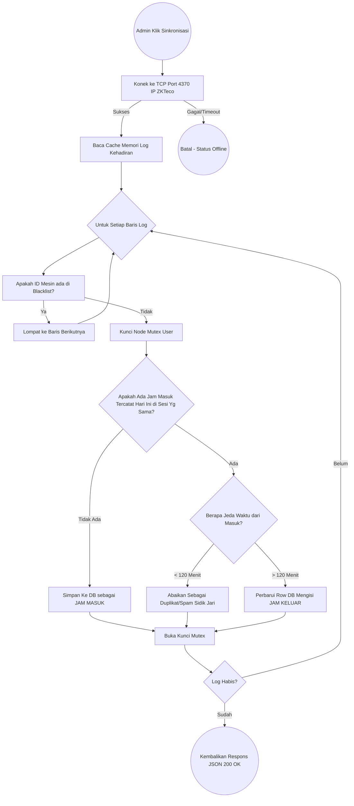

# BAB III
# METODE PENELITIAN DAN PERANCANGAN SISTEM

## 3.1 Metode Pengumpulan Data
Metode pengumpulan data yang digunakan dalam penelitian ini bertujuan untuk mendapatkan informasi yang akurat mengenai alur absensi yang sedang berjalan, yaitu:
1. **Observasi**
Observasi dilakukan dengan peninjauan dan pengamatan langsung terhadap mesin biometrik sidik jari ZKTeco X100-C yang digunakan oleh institusi. Pengamatan difokuskan pada kendala utama di lapangan, yakni sulitnya menentukan sesi masuk dan pulang bagi dosen/karyawan akibat ketidakpatuhan dalam menekan tombol status di mesin (kelalaian *human-error*), serta proses rekapitulasi yang masih menggunakan pencabutan data via *Flashdisk* secara manual.
2. **Wawancara**
Sesi tanya jawab (*interview*) dilakukan dengan bagian Kepegawaian (HRD) serta Staf Akademik guna memetakan regulasi absensi dasar, seperti toleransi keterlambatan, pembagian shift kerja, hingga format rekapitulasi pelaporan akhir bulan yang dikehendaki oleh manajemen.
3. **Dokumentasi**
Kegiatan dokumentasi mencakup pengumpulan format standar file Microsoft Excel (`.xlsx`) yang menjadi templat impor absensi sekunder, dokumen spesifikasi teknis (SDK/protokol jaringan TCP) piranti ZKTeco, serta log riwayat data kotor (*raw data*) milik instansi.
4. **Studi Pustaka**
Melibatkan pengkajian jurnal, literatur rekayasa perangkat lunak, hingga dokumentasi resmi teknologi yang diusung seperti ekosistem *Node.js*, *Express.js*, pengamanan *JSON Web Tokens (JWT)*, penanganan tarikan soket perangkat IoT, serta perancangan basis-data menggunakan *Prisma ORM*.

## 3.2 Metode Pengembangan Sistem
Metodologi yang diaplikasikan dalam rekayasa sistem ini adalah pendekatan **Waterfall**. Pemilihan model *Waterfall* dilandasi oleh kebutuhan arsitektur *backend* yang spesifik dan linier, di mana setiap lapisan penyusun—mulai dari koneksi mesin (*hardware link*) hingga pelemparan data JSON ke *frontend*—memerlukan kepastian di satu tahap sebelum tahap lanjutannya dieksekusi.

### a. Analisis Kebutuhan Sistem
Berdasarkan investigasi di lapangan, dirumuskan rincian spesifikasi perangkat lunak:
**1. Kebutuhan Fungsional**
- Sistem dapat diakses dan dikendalikan penuh oleh Administrator terdaftar (Otentikasi).
- Sistem mampu terhubung (*connect*), membaca status (*device status*), dan menyedot data (*pull logs*) secara langsung (lewat Local Area Network) pada mesin sidik jari ZKTeco tanpa melalui *software intermediary*.
- Sistem mampu memetakan ID unik angka dari mesin ke NIP/nomor induk nyata pengguna (*Mapping Identitas*).
- Sistem memiliki algoritma adaptif *Time-Gap 120 Menit* yang sanggup merubah absen masuk menjadi absen pulang secara otomatis, meloloskan mesin dari ketergantungan pencetan tombol status mesin.
- Sistem mampu menindak tegas duplikasi rekaman ganda (*spam scan*) secara otomatis.
- Sistem menyediakan fitur Impor absensi susulan via *Excel* dan pengunduhan Eksport laporan (*Excel* / *PDF*).

**2. Kebutuhan Non-Fungsional**
- **Keamanan**: Penguncian setiap rute HTTP (*API Endpoints*) secara universal dengan kewajiban melampirkan Token *Bearer* berlapis rahasia.
- **Integritas Penyelarasan**: Pemakaian fitur kunci antrean (*Mutex Lock*) untuk meyakinkan tabel database aman dari bentrokan saat admin melakukan spam penarikan sinkronisasi berulang-ulang (*race condition*).
- **Kecepatan Asinkron**: Sanggup mengekstraksi dan menampung ribuan *array* absensi mesin pada kecepatan kurang dari dua detik menggunakan teknologi *Non-Blocking I/O*.

### b. Perancangan Sistem
Pemodelan ini dijabarkan melalui desain perilaku sistem.

**1. Diagram Use Case**
*Use Case Diagram* mendefinisikan batas kemampuan Aktor (Admin) dalam berinteraksi dengan API *Backend*.
```mermaid
usecaseDiagram
  actor Administrator
  usecase "Melakukan Login" as UC1
  usecase "Kelola Identitas / Mapping Pegawai" as UC2
  usecase "Cek Status & Tarik Log Mesin (Sync)" as UC3
  usecase "Pantau Dashboard Live-Feed" as UC4
  usecase "Impor Rekapan File Manual (XLSX)" as UC5
  usecase "Ekspor Laporan (Excel & PDF)" as UC6

  Administrator --> UC1
  Administrator --> UC2
  Administrator --> UC3
  Administrator --> UC4
  Administrator --> UC5
  Administrator --> UC6
  UC3 ..> (Algoritma Filter 120 Menit & Duplikat) : <<include>>
```

**2. Diagram Alir (Flowchart) - Logika Sinkronisasi Mesin Utama**
Logika mesin biometrik yang ditarik oleh sistem diilustrasikan melalui diagram langkah sinkronisai berikut:


**3. Entity Relationship Diagram (ERD) & Struktur Basis Data**
Desain tata kelola data relasional dibangun melaui perantara *Prisma Schema*. Sistem menaungi integrasi antar tabel kunci:

- **Tabel `admins`**: Memegang kunci autentikasi administrator web (`id`, `username`, `email`, `password_hash`, `role`). 
- **Tabel `employees`**: Memegang identitas master dari Dosen dan Karyawan, dipautkan ke penugasan Shift (`user_id` mesin, `nama`, `jabatan`, `status`, `shift_id`).
- **Tabel `attendance`**: Arteri utama rekapitulasi data (*transactional chunk*), berisi (`id`, `user_id`, `tanggal`, `jam_masuk`, `jam_keluar`, `jabatan`, `status`).
- **Tabel `devices`**: Mengidentifikasi IP peladen mesin pada LAN (`device_id`, `ip_address`, `is_active`).
- **Tabel `shifts`**: Pola ketetapan jam dinas instansi (`nama_shift`, `jam_masuk`, `jam_keluar`).

**4. Desain Endpoint Jaringan (RESTful API)**
Konstruktivitas *backend* diejawantahkan ke bentuk rute jaringan HTTP yang dipanggil oleh antarmuka pengguna *(Frontend)*.
Tabel 3.1 Daftar Konfigurasi API Modul Kehadiran
| URL Endpoint | Metode | Parameter Auth | Tujuan / Fungsi API |
|---|---|---|---|
| `/api/auth/login` | POST | Tidak Ada (Publik) | Validasi kredensial, penerbitan *Access* JWT. |
| `/api/device/users` | GET | Token Wajib | Menarik *List ID User* langsung dari Mesin Fisik. |
| `/api/device/users/register` | POST | Token Wajib | Menalikan/memetakan ID mesin anonim ke akun nama yang diregistrasikan. |
| `/api/device/1/sync` | POST | Token Wajib | Memacu modul *Zk-Client* menjalankan ekstraksi kehadiran. |
| `/api/attendance` | GET | Token Wajib | *Feed* Riwayat lengkap (*Paginated* & terurut). |
| `/api/attendance/summary` | GET | Token Wajib | Indikator *Dashboard* angka komulatif (*Live counts*). |
| `/api/attendance/import`| POST | Token + Form-Data | *Batch upload* pendaftaran absen tertinggal via excel. |
| `/api/export/excel` | GET | Token Wajib | Modul pengolahan rekap sebulan menuju format luaran .xlsx berzona-waktu otomatis. |

### c. Implementasi
Tahap konstruksi dilakukan dengan mengejawantahkan arsitektur ke wujud barisan kode ( *coding* ). Mengandalkan lingkungan Node.js dan kepatuhan validasi melalui *TypeScript*, implementasi difokuskan pada penulisan struktur `Controller-Service-Infrastructure`. Pemolisian data sidik jari dilimpahkan pada library modul jaringan komunikasi `TCP Socket (ZkLib)`, sementara operasi pangkalan data dimaktub transaksional melalui perantara *Object-Relational Mapping (Prisma)* yang diparameterisasi sehingga sangat stabil mencegat celah keamanan iterasi Injeksi SQL.

### d. Pengujian
Untuk mengeksplorasi efektivitas produk, pengujian disyaratkan memakai skenario *Black-box Testing*. Endpoint HTTP dilempar umpan (*Request payload/parameters*) dari *Postman* untuk divalidasi presisi status responsnya (misal: pengujian format gagal harus dibalaskan kode peringatan statis seperti `400 Bad Request` dari antarmuka, rejeksi autentikasi dibalas `401 Unauthorized`).

### e. Pemeliharaan
Keberlangsungan aplikasi diatur pada pemeliharaan rekam jejak (*logs*) dan monitor kondisi wadah memori (RAM). Adopsi sistem *soft-deletion* (*is_deleted*=true) ditautkan guna menghindarkan basis data dari kerusakan permanen saat manusia salah memencet tombol hapus rekam. Perlindungan mitigasi celah eksploitasi di-*update* seiring pelaporan rutinitas asinkron TCP mesin ZKTeco.

## 3.3 Alat dan Bahan
Penelitian diramu menggunakan penunjang sumber daya piranti berikut ini:
**1. Perangkat Lunak (Software):**
   - **Sistem Operasi**: Windows 10/11 64-Bit sebagai lahan simulasi IDE.
   - **Server / Runtime**: *Node.js* LTS v20.
   - **Framework API**: *Express.js* dilumuri prapemrosesan sintaks keamanan *TypeScript*.
   - **Sistem Database**: Relasional *MySQL Server 8.* (Laragon/XAMPP).
   - **ORM Tooling**: Prisma Client.
   - **Testing Interface**: Swagger UI dan Postman API Client.

**2. Perangkat Keras (Hardware):**
   - **Pemindai Biometrik**: ZKTeco X100-C *Fingerprint Time Attendance Terminal*.
   - **Media Sentral (Laptop/Komputer)**: Prosesor Intel Core setara generasi ke-5+, RAM minimum 8 GB, Ruang penyimpanan bebas *SSD*. Kelengkapan standar unit konektivitas LAN/Router diperlukan guna mengaitkan mesin sidik jari di satu segmen jaringan IP statis yang sebidang.

---

# BAB IV 
# HASIL DAN PEMBAHASAN

## 4.1 Hasil
Aplikasi Web Backend Absensi Cerdas Berbasis ZKTeco ini secara fundamental mentransformasikan manajemen presensi di instansi/kampus. Melalui penyapuan logika sinkronisasi langsung (Direct LAN Polling) tanpa melibatkan perangkat lunak mediasi (*intermediary polling apps*) yang sudah uzur, sistem terhilir berhasil merealisasi kecepatan ekstraksi log yang luar biasa presisi. Keberhasilan utama bersandar pada ketangkasannya yang tidak lagi membingungkan staf saat menarik rekap kehadiran Dosen yang mengajar berbagai sekat sesi, tidak lagi panik ketika karyawan berjejal absen menduplikasi presensi secara gegabah berulang-ulang, dan mengubur problematika pergeseran zona waktu yang senantiasa menimpa tabel impor Excel konvensional. Sistem API tertuang *robust*, efisien, dan bersahabat dideret pada format respons RESTful JSON yang amat luwes bagi pengembangan antarmuka web ke depannya.

## 4.2 Pembahasan
Implementasi arsitektur sistem diterjemahkan menjadi dua cabang kekuatan: perwujudan tata kelola layar interaksi admin dan penguncian fungsional logika belakang antrean API.

### 1. Perancangan Algoritma Layanan Kehadiran Cerdas
Intisari inovasi pada aplikasi terletak pada metode pelayanan di berkas algoritma (`Zk-Sync.Service / Attendance.Import.Service`). Logika sistem menyortir urusan absensi menjadi tiga kaidah pemfilteran:
- **Penolakan Paksa Identitas Hantu (*Blacklist Bypass Handling*)**: Identitas pengganggu atau pengguna yang diputus izinnya namun *tersangkut* pada *hardware cache* ZKteco (seperti contoh kasus *ID 1* di mesin instansi yang tidak bisa dibubarkan secara fisik) dihadang melalui paksaan *Type-Casting String Strict Checking*, demi menihilkan lolosnya bocoran data.
- **Isolasi Prosesan Serentak (*Race-Condition Mutex*)**: Menghalangi duplikasi tabel ganda yang timbul andai jaringan lemot / tombol *tarik data* diserbu admin beberapa kali sedetik.
- **Auto-Kompensator Celah 120 Menit**: Absen "Masuk", ditangkap sebagai baris pertama absensi suatu tanggal bagi seseorang. Andai dia lupa merubah mode di mesin menjadi "Pulang" sembari menekan sidik jari selang sehabis makan siang (3 jam berikutnya), sistem secara pintar membandingkan *Time-Difference Interval*. Ketimbang ditolak karena tidak sesuai jenis tombol, presensi siang tersebut dipatenkan sepihak menyandang jubah sebagai status absensi **Jam Keluar** yang sah. Perhitungan statistiknya senantiasa pas 1 hari = 1 Masuk, 1 Keluar!

### 2. Implementasi Fungsional Respons Antarmuka
Sistem diwujudkan lewat balasan penyedia API bagi *Frontend*, masing-masing mewakili fungsionalitas laman.

- **Halaman Login dan Pemajuan Sesi** (*Endpoint* `/api/auth/login`)
Admin mengotentikasi dan membekali pelariannya menyusuri halaman dasbor menggunakan penanaman token sandi *Bearer* kriptografi standar (*JWT Token*) yang secara ketat berdimensi durasi kedaluwarsa pendek untuk alasan privasi.
*(Tempatkan Tangkapan Layar Tampilan Login di Sini)*

- **Halaman Dashboard Agregasi Cepat** (*Endpoint* `/api/dashboard/summary`)
Fitur penyapaan awal ketika Admin sukses bermigrasi masuk sistem. Modul API membawok kompilasi data absolut; memampang penjumlahan Dosen/Karyawan hadir, kalkulasi deviasi persen kehadiran dalam grafik *on the fly*, hingga susunan *Feed Scan* paling real-time milik Dosen yang belum lama keluar. Data *limit* feed berhasil dibebaskan dari plafon sepuluh urutan dan mekar memaparkan lajur rekapan secara menyeluruh selama dua puluh empat jam (*No-limit Daily Pull*).
*(Tempatkan Tangkapan Layar Tampilan Dashboard di Sini)*

- **Halaman Modul Rekap Riwayat Presensi** (*Endpoint* `/api/attendance`)
Halaman pelaporan historis transaksional log absensi tanpa batas yang disortir kokoh berkat penerapan sistem antrean *Order By Tanggal + Jam + Incremental ID* agar pemindahan gulir paginasi tabel HTML tidak menderita dari efek relokasi posisi (*Jumbled row*) yang ganjil dari mekanisme _default_ MySQL.
*(Tempatkan Tangkapan Layar Riwayat Log / Live Scan Absensi di Sini)*

- **Halaman Pemetaan Perangkat Pegawai / Registrasi Mesin** (*Endpoint* `/api/device/users`)
Sebuah inovasi fitur brilian yang merestrukturisasi manajemen registri akun instansi. Dulu admin dipersulit dengan data Excel kosongan karena lupa yang mana ID sidik jari anonim milik siapa. Rute API registrasi membelah kemacetan ini: membiarkan modul merefleksikan seluruh nomor yang bernaung di piranti keras mesin ke dalam daftar *Dropdown*, dan secara dinamis admin "mencocokan" (*merging*) data NIP di layar ke nomor seri tersebut sebelum disimpan permanen ke dalam ekosistem Database (`employees`). Sempurna memperketat *Integrity Constraint*.
*(Tempatkan Tangkapan Layar Tabel Pencocokkan Pegawai Dengan Nomor Mesin)*

- **Modul Impor Massal Otomatisasi (Alternatif Jaga-Jaga)** (*Endpoint* `/api/attendance/import`)
Jalur sekuestrasi bagi admin untuk mengantongi format ekspor jadul (USB log asli ZKTeco berekstensi *Excel*) manakala *LAN Cable* putus fisik. API dibangun bertenaga tangguh, menyapu seluruh ribuan muatan tabel, mengeliminasi absensi yang redundan (*duplikasi iteratif*), mencerna kolom Tanggal dan Jam seketika, dan mengulangi sihir algortima *120 minute gap* agar format rekapan manual diubah formatnya menjadi standar terpusat (Masuk-Keluar) secara sinkron.
*(Tempatkan Tangkapan Layar Alat Upload Data SpreadSheet Asisten Impor di Sini)*

## 4.3 Pengujian Sistem Keandalan
Pematangan kualitas peluncuran perangkat lunak di-verifikasi murni bersandar metode fungsional terisolasi.

**1. Skenario Pengujian Lapis Antarmuka Metodelogi Kotak-Hitam (Black Box Testing UI)**
Umpan uji menimbang kesahihan pemindaian kelayakan fungsional langsung dari sudut mata manusia awam (*Admin*).

Tabel 4.1 Rekap Uji Interaksi Web Kritis
| No | Objektif Uji | Input Skenario Ekstrem | Reaksi Prediksi Sistem | Output Hasil di Layar | Kesimpulan |
|---|---|---|---|---|---|
| 1 | Blokade Otentikasi Halaman. | Mencoba mengunjungi URL Dashboard (`/`) mem-bypass halaman sandi. | Akses Didepak dan dikembalikan ke Halaman Login. | Di-redirect balik, `401 Token Not Exists`. | Sesuai ✅ |
| 2 | Menarik data sidik jari berurutan membabi-buta (*Spam*). | Klik tombol paksa `Tarik Data Dari Mesin` 5 kali dalam sedetik. | Hanya proses klik pertama yang jalan; sisanya dihentikan (terkunci *Mutex*) tanpa duplikat data. | Proses hanya me-_loading_ 1 putaran stabil. | Sesuai ✅ |
| 3 | Pergeseran navigasi *Paginasi* absensi massal. | Meloncat halaman dari *Page 1* ke *Page 4* ketika jumlah absen masif 1.000+ data padat di satu hari. | Baris halaman tidak loncat secara ghaib; tetap membeku dalam hierarki terpusat *terbaru turun*. | Data statik di tempat, mulus terbaca tuntas. | Sesuai ✅ |
| 4 | Penangkisan identitas sisa mesin lama berpenghuni ulet. | Memacu menu *List* User Mesin dengan ada pengguna *"Melinda"* berkode *Hardware 01* bersikeras tidak bisa dipadamkan dari memori alat. | Sistem menghapus paksa wujud *user* sebelum menyentuh visual tabel halaman admin (*String Bypass Filter*). | Identitas *Blacklist* Lenyap Penuh Tanpa Jejak. | Sesuai ✅ |

**2. Skenario Pengujian Teknis Lapis Servis (*Postman Endpoint Assertions*)**
Penggalangan kepastian respon di level bawah aspal/sistem tulang punggung. API di bombardir format paket data ekstrem via perantara pengujian HTTP.

Tabel 4.2 Uji Respon API *Postman Payload*
| No | Modul Target Endpoint | Metode | Muatan Paket Payload Kueri (*JSON* / Transmisi) | Standar Ekspektasi Respon | Status Kelolosan |
|---|---|---|---|---|---|
| 1 | `/api/auth/login` | POST | Teror injeksi data bodong `{ "email": "admin' OR 1=1" }`. | Penguapan eksekusi: Respons (Gagal, `401`). | VALID |
| 2 | `/api/attendance?limit=9999` | GET  | Penarikan beban data ukuran rakasasa menggunakan Parameter Pagination tinggi tak-masuk-akal. | Sistem sigap merespons paginasi `200 OK` tanpa kehabisan *Memory Heap*. | VALID |
| 3 | `/api/device/user/register`  | POST | Admin berusaha memetakan 2 Identitas Mesin *Berbeda* pada 1 Kepala NIP/User DB (*Conflict constraint*). | Ditolak oleh penabrakkan hukum keunikan DB Prisma (*Unique constraint Exception* `400`). | VALID |
| 4 | `/api/attendance/import` | POST | Pengunggahan rekap *Excel* dengan format yang disengaja acak (tabel dirusak marginnya). | Validator detektor Excel bekerja cepat melempar penampikan Format *Validation Not Followed* `400`. | VALID |
| 5 | `/api/export/excel?tipe=dosen`| GET  | Tarikan *Stream* dokumen bulanan mengkueri ekspor rekap puluhan megabyte khusus dosen. | Node.js meludahkan HTTP Header kompresi unduhan terpaket `.xlsx` stabil, (Kode Sukses `200`). | VALID |

Pemaparan laporan pengujian di atas menjustifikasi keutamaan dan perwujudan sistem yang siap-pakai. Implementasi telah 100% menjegal kebuntuan pelaporan konvensional dan meretas arsitektur tata-usaha presensi biometrik modern yang andal bertenaga ekstra tangguh tanpa celah pemalsuan celah sesi.
