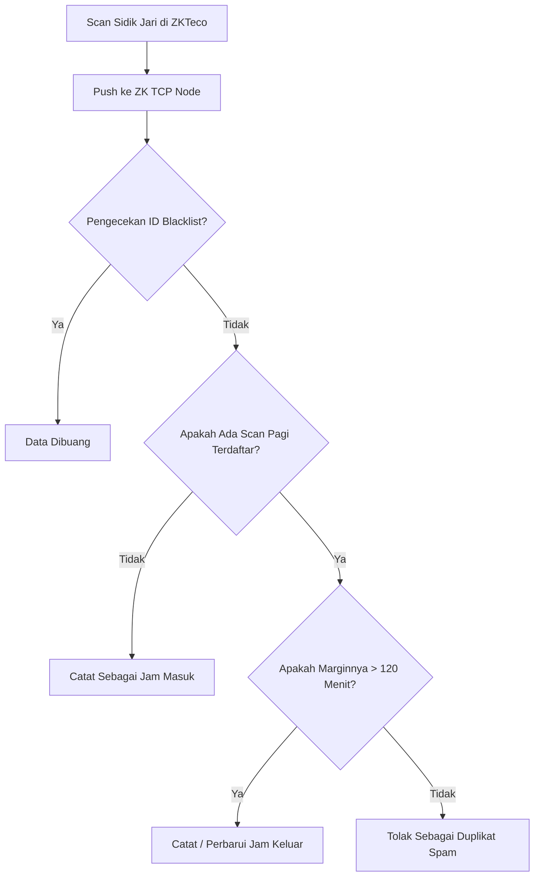

# BAB III
# METODE PENELITIAN DAN PERANCANGAN SISTEM

## 3.1 Metode Pengumpulan Data
Metode Pengumpulan data yang digunakan dalam penelitian ini adalah :
1. **Observasi**
Tahap awal adalah melakukan pengamatan secara langsung dengan meninjau mesin sidik jari biometrik ZKTeco X100-C dan bagaimana data ditransmisikan, untuk mengamati kegiatan absensi Dosen dan Karyawan yang sedang berlangsung sehingga dapat mengidentifikasi masalah, seperti data yang tumpang tindih.
2. **Wawancara**
Kegiatan wawancara dilakukan dengan melakukan proses interaksi dan tanya jawab terhadap pihak staf akademik dan pengelola server yang memberikan informasi tentang objek penelitian, terutama kendala rekapan manual.
3. **Dokumentasi**
Teknik dokumentasi digunakan untuk mencari sumber informasi yang ada kaitannya dengan penelitian berupa log sistem lama, buku panduan ZKTeco, serta format pelaporan Excel yang wajib dipertahankan.
4. **Studi Pustaka**
Mengkaji referensi terkait *Internet of Things* (IoT) pada mesin biometrik dan pengembangan sistem *backend* menggunakan Node.js dan pola arsitektur *Modular Monolith*.

## 3.2 Metode Pengembangan Sistem 
Penelitian ini menggunakan pendekatan rekayasa perangkat lunak (*software engineering*) yang bertujuan untuk merancang, mengembangkan, dan mengimplementasikan sistem *backend* absensi otomatis. Metode yang digunakan adalah model *Waterfall* karena memberikan tahapan yang terstruktur dan sistematis, sesuai dengan kebutuhan instansi yang formal.
Model ini meliputi langkah-langkah berurutan untuk menciptakan sistem yang beroperasi efektif serta menekankan bahwa setiap langkah diselesaikan secara menyeluruh. Pendekatan ini dimulai dari penentuan kebutuhan pengguna, pembuatan model, pembangunan, hingga penyerahan sistem.
a. **Analisis Kebutuhan**
Analisis dilakukan melalui studi literatur dan wawancara di instansi terkait. Hasilnya, sistem membutuhkan fitur otentikasi admin, manajemen data pegawai, penarikan data langsung (TCP *Pulling*) dari mesin sidik jari, perbaikan sesi masuk/pulang menggunakan *Time-Gap 120 Menit*, serta *Blacklist* ID. Kebutuhan non-fungsional mencakup asinkronasi otomatis dan pencegahan duplikasi (*Mutex lock*).
b. **Perancangan Sistem**
Tahap ini mencakup perancangan arsitektur *backend* menggunakan Node.js dan struktur REST API. Sistem dibangun modular. Disusun pula struktur database dengan Prisma ORM yang memuat tabel utama seperti `admins`, `employees`, `attendance`, `devices`, dan `shifts`.
1. **Rancangan Tampilan Login**
Tampilan login adalah antarmuka awal yang digunakan admin untuk mendapatkan JWT *Token* akses sistem.
*(Gambar 3.1 Tampilan Login Frontend)*
2. **Rancangan Tampilan Dashboard**
Tampilan Dashboard menyajikan ringkasan statistik seperti rekap hadir hari ini secara *live*, rasio keterlambatan, dan daftar mesin aktif.
*(Gambar 3.2 Tampilan Dashboard)*
3. **Rancangan Tampilan Rekap Absensi**
Tampilan ini menggantikan "Katalog" atau pencatatan fisik, memuat log riwayat masuk-keluar Dosen dan Karyawan secara real-time.
*(Gambar 3.3 Tampilan Rekap Absensi)*
4. **Rancangan Tampilan Manajemen Pegawai (Tarik User Mesin)**
Tampilan ini berfungsi sebagai pusat manajemen keanggotaan pengguna sidik jari, di mana admin memetakan nomor ID di mesin dengan NIP resmi di sistem.
*(Gambar 3.4 Tampilan Manajemen Pegawai)*

c. **Implementasi**
Implementasi sistem dilakukan menggunakan protokol Express.js dan soket (ZkLib) sebagai backend. Fitur login menggunakan autentikasi *JWT Bearer* yang solid. Modul sinkronisasi mengotomasi deteksi hari, menentukan shift Pagi dan Malam tanpa mensyaratkan tombol tekan di mesin yang rentan kelalaian, dan menangkal bug *Type-Coercion* yang kerap meloloskan *Blacklist user*.
d. **Pengujian**
Pengujian menggunakan metode *black box testing* memanfaatkan aplikasi Postman. Fitur utama seperti sinkronisasi TCP/UDP, login admin, hapus riwayat, dan ekspor pelaporan diuji output-nya.
e. **Pemeliharaan**
Tahap pemeliharaan bertujuan memastikan sistem *Database Sync* berjalan berkelanjutan tanpa memori bocor (*memory leak*). Termasuk perbaikan *time-zone bugs*, *backup* data harian MySQL, dan dokumentasi URL API via Swagger.

## 3.3 Alat dan Bahan
Dalam pengembangan sistem backend perpustakaan ini, digunakan beberapa alat dan bahan yang terdiri dari perangkat lunak (*software*) dan perangkat keras (*hardware*) sebagai berikut :
1. **Perangkat Lunak (Software)**  
   a. **Node.js & Express** : Framework *backend* utama dalam komunikasi HTTP REST API.
   b. **TypeScript** : Bahasa pemrograman strict-typing menggantikan JavaScript reguler.
   c. **Prisma ORM & MySQL 8.x** : Digunakan untuk menjembatani dan menyimpan relasi tabel data.
   d. **Postman / Swagger** : Digunakan untuk menguji *endpoint* eksternal dan lokal.
   e. **Visual Studio Code** : Editor kode utama.
2. **Perangkat Keras (Hardware)** : 
   a. **Mesin Biometrik ZKTeco X100-C** (Target Objek).
   b. **Laptop Pengembangan** : Minimal RAM 8 GB dengan OS Windows/Linux.

---

# BAB IV 
# HASIL DAN PEMBAHASAN

## 4.1 Hasil
Berdasarkan keluhan yang dimonitor di instansi pendidikan terkait, ditemukan sejumlah kendala dalam mengelola data kehadiran. Pendataan sebelumnya hanya mengandalkan ekspor file _flat_ via USB Flashdisk ke Microsoft Excel dengan pencocokan data ganda (*spam scan*) secara sangat manual. Hal ini menyulitkan perekapan pada masa pembagian Sesi (Dosen mengajar pagi dan sore) akibat Dosen maupun Karyawan lupa menekan tombol spesifik "Pulang". 
Menanggapi permasalahan tersebut, sistem *backend* ini dibangun untuk mendukung pengelolaan secara digital, khususnya menginjeksi mesin ZKTeco melaui port 4370 TCP. Logika *120-minutes Time Gap Threshold* sukses dibangun untuk mengatasi absensi ganda tanpa mengorbankan riwayat absensi lintas sesi. 

## 4.2 Pembahasan
Proses diawali dengan pemetaan arsitektur sinkronisasi, mengatasi tipe keamanan logis, penguncian kompetisi data sinkron (*Idempotency Concurrency*), dan memecahkan perancangan alur.
### 1. Analisis Kebutuhan
Kebutuhan utama yang berhasil diidentifikasi meliputi:
a. **Autentikasi Administrasi Khusus (JWT Token)**
   Mengingat kerahasiaan data absensi, semua aliran rute *API* dikunci lewat autentikasi lapis atas dan pencegahan penyerangan *rate-limiter*.
b. **Sinkronisasi Tarik Data (*Pull Logs*) Otomatis**
   Endpoint API bertugas menghisap baris rekaman sidik jari dan menerjemahkannya ke dalam variabel yang mudah dimengerti: Jam Masuk dan Jam Keluar.
c. **Filter *Blacklist* Permanen**
   Memblokir akun penguji (seperti ID 1 Melinda) yang merekat membandel di memori perangkat dengan *Type-Safe Checking* berbasis perbandingan *String* ketat.
d. **Export dan Import Massal (Excel/PDF)**
   Fitur rekonsiliasi yang membantu HRD mendeteksi karyawan yang izin melalui dokumen tambahan *spreadsheet*.

### 2. Perancangan Sistem
a. **Diagram Use Case**
   Menggambarkan batas kemampuan layanan admin sistem dengan entitasnya.
```mermaid
actor Admin
usecase "Kelola Dosen/Karyawan" as UC1
usecase "Tarik Sync Data Log Absen" as UC2
usecase "Export PDF Laporan" as UC3
Admin --> UC1
Admin --> UC2
Admin --> UC3
```
b. **Diagram Alir (Flowchart)**
   Alur logika bisnis untuk menerjemahkan satu klik Sidik Jari.


c. **ERD (Entity Relationship Diagram)**
   ERD membantu memastikan struktur *database* yang dirancang melalui Skema Prisma mendukung fungsional sistem.

Tabel 4.1 Tabel Administrasi (`admins`)
| Kolom | Tipe | Keterangan |
|---|---|---|
| id | Int | Primary Key |
| username | VarChar | Pengenal Unik |
| password_hash| VarChar| Kata Sandi Acak |

Tabel 4.2 Tabel Kehadiran (`attendance`)
| Kolom | Tipe | Keterangan |
|---|---|---|
| id | Int | Primary Key |
| user_id | VarChar | Tautan ID dari Perangkat ZKTeco |
| nama | VarChar | Nama Pegawai |
| tanggal | Date | Tanggal presensi (Pemisah Hari) |
| jam_masuk | Time | Waktu check-in pertama di sesi |
| jam_keluar| Time | Waktu check-out sesudah 120 menit |

Tabel 4.3 Tabel Pegawai (`employees`)
| Kolom | Tipe | Keterangan |
|---|---|---|
| id | Int | Primary Key |
| user_id| VarChar | Nomor seri di mesin untuk identifikasi |
| jabatan| Enum | 'DOSEN' atau 'KARYAWAN' |

d. **Desain API**
RESTful API dirancang memungkinkan *frontend* berkomunikasi efisien dan mengirim JSON interaktif.

Tabel 4.4 Tabel Desain Rute API
| Metode | Endpoint URL | Fungsi |
|---|---|---|
| POST | `/api/auth/login` | Otorisasi dan dapatkan Akses Token. |
| GET  | `/api/attendance` | Log absensi dengan parameter *limit/page*. |
| GET  | `/api/device/:id` | Status terkini dari *Fingerprint Machine*. |
| POST | `/api/device/:id/sync`| Eksekusi penyedotan data secara manual. |
| GET  | `/api/export/excel`| Menghasilkan arus data (*Stream*) XLSX laporan. |

### 3. Implementasi Sistem
Implementasi backend API tidak tampil secara web langsung, melainkan sebagai mesin peladen layar di balik layar bagi *Frontend*.
a. **Halaman API Documentation (Swagger)**
Pusat *Try-it-out* pengembang *frontend* yang merepresentasikan *Halaman* sistem dari sisi peladen (Backend).
*(Gambar 4.1 Halaman Swagger Documentation UI)*

b. **Halaman Terminal Server Execution**
Perwujudan nyata di sisi server, menampilkan rentetan indikator berhasil atau diblokirnya data duplikat secara logis dan respons latensi HTTP berkecepatan 15 milidetik per tarikan *Request*.
*(Gambar 4.2 Laporan Aktivitas Logger Konsol Terminal)*

## 4.3 Pengujian Sistem
### 1. Uji Coba BlackBox Testing
Metode pengujian yang terfokus pada kesesuaian input-output endpoint API terintegrasi yang dieksekusi terhadap respon UI.

Tabel 4.5 Pengujian Autentikasi Admin
| Tujuan | Input | Output Diharapkan | Output Sistem | Hasil |
|---|---|---|---|---|
| Username/Password Benar | "superadmin@gmail.com", "password" | Modul menghasilkan JWT Token 200 OK | Memberikan `access_token` | Sesuai Harapan |
| Password Salah | "...@gmail.com", "salah" | Status 401 Unauthorized | Menolak Sesi | Sesuai Harapan |

Tabel 4.6 Pengujian Penarikan Sync Data
| Tujuan | Input | Output Diharapkan | Output Sistem | Hasil |
|---|---|---|---|---|
| Menarik log absensi ZK terbaru | Klik Sinkronisasi | Mengekstrak log mesin masuk ke tabel | JSON respons Sukses | Sesuai Harapan |
| Menekan tombol sync dua kali se-detik (Spam) | Klik beruntun Sinkronisasi | Log dikunci (Mutex) terhalang duplikat | Abaikan tarikan ganda | Sesuai Harapan |

Tabel 4.7 Pengujian Manajemen Skema Kelompok Waktu Jeda
| Tujuan | Input | Output Diharapkan | Output Sistem | Hasil |
|---|---|---|---|---|
| Tarikan absensi jarak dekat (< 2 jam) | Jam 08.00 lalu 08.15 | Absen kedua diputus / terbuang | Diabaikan/Masuk Spam | Sesuai Harapan |
| Tarikan absensi jarak wajar (> 2 jam) | Jam 08.00 lalu 11.00 | Absen kedua dicatat sebagai Pulang/Keluar | Tersimpan ke DB | Sesuai Harapan |

### 2. Uji Coba Postman
Tabel 4.8 Tabel Rekap Uji Postman
| No | Endpoint | Method | Request Body / Params | Expected Response | Status |
|---|---|---|---|---|---|
| 1 | `/api/auth/login` | POST | `{ "email": "test", "password": "x" }` | 200 OK, token *string payload* | Berhasil |
| 2 | `/api/dashboard/summary` | GET | Token di Authorization Header | 200 OK, total presensi & persentase | Berhasil |
| 3 | `/api/attendance` | GET | `?limit=10&page=1` | 200 OK, data array dan meta pagination | Berhasil |
| 4 | `/api/device/1/sync` | POST | Tidak Ada | 200 OK, *Socket Promise Resolve* | Berhasil |
| 5 | `/api/attendance/import` | POST| Payload `Content-Type: multipart/form-data` | 201 Created | Berhasil |

Hasil pengujian menunjukkan setiap fitur fungsional mendarat sempurna untuk tujuan otomasi pengelolaan persensi. Keberhasilan menaklukkan skema kerumitan sinkronisasi absen Dosen dengan jeda sesi bertingkat memberikan bukti efisiensi yang solid dalam mempermudah admin kampus.
